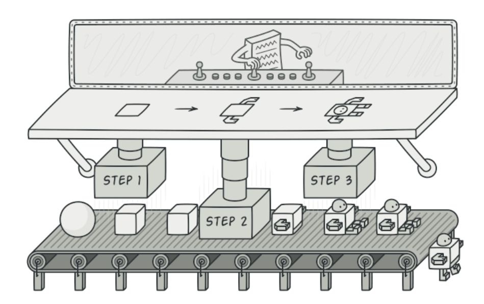
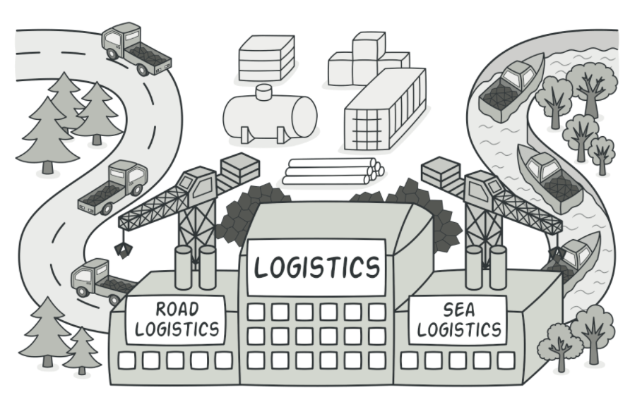

# design-patterns

# Introduction
This Repository contains sample code which I developed while learning SOLID Principles and Design Patterns

# Images Source
All Images source is https://refactoring.guru/

## Build Pattern
1. Some objects are simple while some are not
2. Hence these complex objects are difficult to be intialized in a single call
3. Having an initializer with 10 arguments is not a good way
4. Hence we can opt for 'piecewise construction'
5. Builder provides an API for constructing the object step-by-step

## Factory Pattern
1. Outsourcing the creation of object
2. Different from Builder as it is not piecewise but wholesale
3. Can create hierarchies of type (Abstract Factory)

