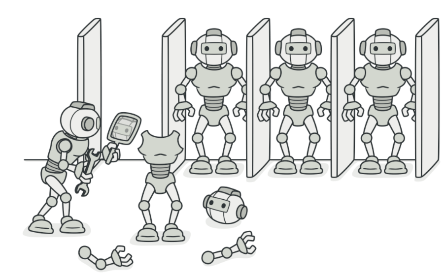

# design-patterns

# Introduction

This Repository contains sample code which I developed while learning SOLID Principles and Design Patterns

# Images Source

All Images source is https://refactoring.guru/

## Build Pattern

1. Some objects are simple while some are not
2. Hence these complex objects are difficult to be intialized in a single call
3. Having an initializer with 10 arguments is not a good way
4. Hence we can opt for 'piecewise construction'
5. Builder provides an API for constructing the object step-by-step

## Factory Pattern

1. Outsourcing the creation of object
2. Different from Builder as it is not piecewise but wholesale
3. Can create hierarchies of type (Abstract Factory)

## Prototype Pattern

1. Complicated objects (eg. cars) are not created from scratch each time. We have an existing design and have a prototype first and then we just clone or copy the prototype
2. This helps to create objects without knowing in details the components of the class
3. A prototype is a partially or fully initialized object that you copy (clone) and make use of it

## Singleton Pattern

1. Lets you ensure that a class has only one instance, while providing a global access point to this instance.
2. Used when a single instance is required of some class throughout the project.
3. For example, you may want only a single connection object to the database and every class can use the same object

## Adapter Pattern

1. A construct which adapts an existing interface X to conform to the required interface Y
2. It allows objects with incompatible interfaces to collaborate

## Bridge Pattern

1. Prevents 'cartesion product' complexity explosion
   a. 2 shapes and 2 colors (2X2). Add another shape and combinations become (3X2)
2. A mechanism that decouples an interface from an implementation
3. Difficult to maintain a huge monolith
4. Hence split into smaller components for easier maintainability

## Composite Pattern

1. Lets you compose objects into tree structures and work with these objects as if they are individual objects
2. Basically lets you make compound objects
3. Objects use the objects' properties through inheritance and composition
4. Use the pattern when you want the client code to treat both simple and complex elements uniformly.

