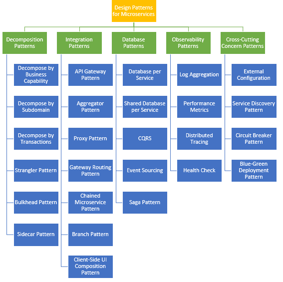

# microservices-design-patterns

# Introduction

This Repository contains sample code and notes which I developed while learning Design Patterns for Microservices

# References

https://dzone.com/articles/microservice-architecture-and-design-patterns-for

# Decomposition Patterns

## Decompose by Business Capability
1. Eg. Order Management is responsible for orders
2. Eg. Customer Management is responsible for customers
3. Suitable for greenfield apps

## Decompose by Subdomain
The subdomains of an Order management include:
1. eg. Product catalog service
2. eg. Inventory management services
3. eg. Order management services
4. eg. Delivery management services
5. Suitable for greenfield apps

## Decompose by Transactions
1. Break down a huge transaction into smaller transactions
2. Number of transactions increases in the system
3. This actually slows down the system since co-ordinating transactions between multiple microservices can be an overhead
4. Hence this approach is avoided in high load scenarios
5. Suitable for greenfield apps

## Strangler Pattern
1. Suitable for brownfield apps
2. Used to transform the legacy app into new app 
3. The Strangler Application steps are:
	a. Transform — create a parallel new site with modern approaches.
	b. Coexist — leave the existing site where it is for a time. Redirect from the existing site to the new one so the functionality is implemented incrementally.
	c. Eliminate — remove the old functionality from the existing site.

## Bulkhead Pattern
1. Failure tolerance 
2. Elements of an application are isolated into pools so that if one fails, the others will continue to function

## Sidecar Pattern
1. Deploy components into separate process or container to provide isolation and encapsulation
2. Allows heterogeneous components to work together
3. Sidecar and Parent component share same lifecycle